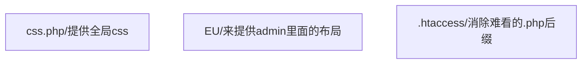
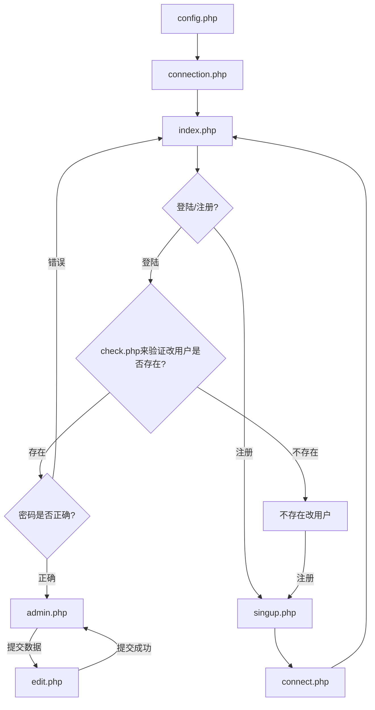

# 一、缘由
**自己最近学完PHP和Mysql，就尝试写了一个留言本，但还有很多不好和错误的地方，欢迎大家多多指导!**

## [项目地址/GITHUB](https://github.com/emperinter/MessageBoard)
## [项目目前demo](https://www.emperinter.cf)

# 二、配置步骤

## 1.首先安装lnmp环境
**[lnmp官网](https://lnmp.org/)**

具体就不聊了，详情见**[WORDPRESS安装教程](https://www.emperinter.info/2018/09/06/%e6%90%ad%e5%bb%bawordpress%e5%8d%9a%e5%ae%a2/)**

> 注意记住填入数据库用户名和密码等等类似的东西

## 2.配置服务器数据库

- 进入数据库后台，按提示输入密码，安装lnmp的时候已经有了
 ``` SHELL
mysql
```

- 创建数据库**notebook**
``` SQL
create database notebook;
```

- 选择数据库**notebook**
``` SQL
use notebook;
```
- 创建数据表**user**
``` SQL
CREATE TABLE IF NOT EXISTS user (
userid int(32) NOT NULL AUTO_INCREMENT,
username varchar(64) NOT NULL,
password varchar(64) NOT NULL,
createtime datetime NOT NULL,
createip varchar(32) NOT NULL,
PRIMARY KEY (userid)
) ENGINE=InnoDB DEFAULT CHARSET=utf8;
```
- 创建数据表**note**
``` SQL
CREATE TABLE IF NOT EXISTS note (
noteid int(32) NOT NULL  AUTO_INCREMENT,
username varchar(64) NOT NULL,
note longtext NOT NULL,
date datetime NOT NULL,
PRIMARY KEY (noteid)
) ENGINE=InnoDB DEFAULT CHARSET=utf8;
```

## 3.安装
- ### 域名购买
##### [推荐购买网站---英文网站/支持支付宝/价格我感觉比较透明且便宜](https://www.namesilo.com/pricing?rid=415d732iq)

 优惠代码：（可节省1美刀） 
> #### emperinter

<div align="center">
<a href="http://www.namesilo.com/?rid=415d732iq"></a>
</div>

- ### CDN/域名解析
##### [CloudFlare](https://dash.cloudflare.com)
> 有免费的CDN支持，而且可以隐藏自己的服务器IP，还支持很多的功能，大家慢慢探索，但如果英语不好的话，也可能费点事！


## 4.服务器安装/配置
- 服务器配置
``` SHELL
lnmp vhost add
```
和WordPress安装类似，但在选择**是否创建数据库的时候，选择不创建**

参考：[搭建WordPress博客](https://www.emperinter.info/2018/09/06/%e6%90%ad%e5%bb%bawordpress%e5%8d%9a%e5%ae%a2/)

- 获取我[Github上面的代码](https://github.com/emperinter/MessageBoard)
```
git clone git@github.com:emperinter/MessageBoard.git
```
如**服务器未安装GIT，请参考[Git使用教程](https://www.emperinter.info/2018/12/03/github/)**

- 修改config.php(**数据库配置文件**)
``` PHP
<?php
define('DB_HOST','localhost');                 //一般不改
define('DB_USER','YourUserName');                         //mysql用户名，一般不改
define('DB_PWD','YourPasword');          //mysql数据库密码
define('DB_NAME','notebook');        //我们创建的数据库
define('DB_CHARSET','utf8');         // 编码格式
?>
```

# 三、各个文件的功能和作用






# 四、美中不足的地方
- admin.php针对具体用户的note无法分页显示；
- 后台无法编辑和删除文本
- 难看，这个CSS没看过就凑活一下吧！
- 前台和后台数据不能即使更新，有时候可能还更新不出来
- 无超级管理员后台


# 五、版权注意
EU文件夹里面的所有东西归属EasyUI和Bootstrap所属，如由使用者产生相关的法律责任与我无关，具体详情请自己去查看相关版权规定！

我刚才了解了一下如何选择开源协议，然后就去查看了[EasyUI](http://www.jeasyui.com/contact.php)和[Boostrap](https://github.com/twbs/bootstrap/blob/master/LICENSE)的协议，发现**EasyUI有** **[Commercial License](http://www.jeasyui.com/contact.php)**(商业协议)，但对于个人用户没有明确说明。而Boostarp则为MIT协议，因此受到此影响应该不大，所以若有想商业使用的人请去购买使用权限,以避免不必要的法律纠纷。

> 我后续会替换掉EasyUI的部分

